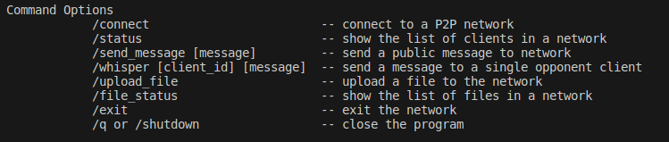

# PituPiPy - P2P Chat and File Transferring
  

PituPiPy is a Python implementation of P2P (peer-to-peer) networking program that enables users to message and share files within in a P2P network pool.

A network requires one tracker to be setup and clients should type the ip and port information of the tracker in order to join a network. Details of how to start up each program are outlined below.

## How to Start
The program requires `pipenv` to be installed locally.  
`pipenv -v`  
`pipenv install`  
If the above command does not work in your environment, you must install pipenv.  
`pip install pipenv`  

Initiate with the command,  
`python pitupipy/app.py`

Press keyboard up or down to choose the program (tracker or client) to start.

## Commands

`COMMAND? [/q or /help] >> /help`  

